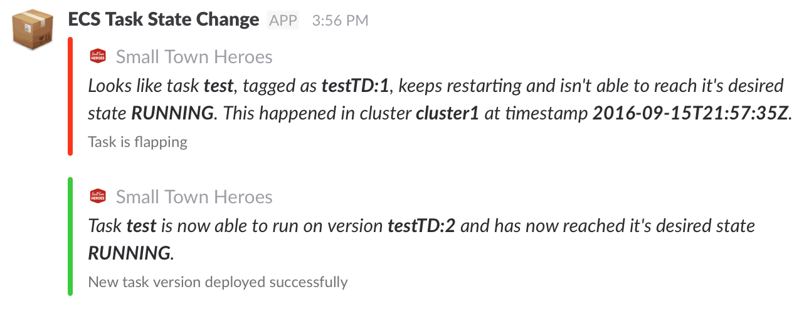

# Pushing ECS Task state changes to Slack

## Description
An [AWS Lambda](https://aws.amazon.com/lambda/) Function that posts notifications to [Slack](https://slack.com/) when changes occur. It checks if a task has been stuck trying to reach it's desired state (running). The function will only post to Slack in the following cases:
- When a task is stuck and isn't able to maintain running state for longer than 10 seconds after 5 failed attempts
- When a new version of a failing task (with over 5 failed attempts) gets deployed
- Whenever a new task gets deployed (if the variable is set to `true`)

## Setting up
### Install Serverless Framework
Use npm to install the framework with `npm install serverless -g`.

### AWS Credentials
For more information visit the following link: [https://serverless.com/framework/docs/providers/aws/guide/credentials/](https://serverless.com/framework/docs/providers/aws/guide/credentials/).

### Policies
Check the following link: [https://serverless.com/framework/docs/providers/aws/guide/iam/](https://serverless.com/framework/docs/providers/aws/guide/iam/).

### DynamoDB
Simply create a table on either a dynamodb-local or [AWS DynamoDB](https://aws.amazon.com/dynamodb) with `id` as it's hash key (S).
You can add an Index for `task` (S) if you would like to expand on this function in the future.

### Policies
If you are using a dynamodb-local container to handle your database you have to make sure the AWS Lambda traffic to your EC2 Instance is allowed. If you are in fact using an AWS DynamoDB you'll have to define a policy so your Lambda function can actualy GET,POST,DELETE and PUT to your database. Check the following link [https://serverless.com/framework/docs/providers/aws/guide/iam/](https://serverless.com/framework/docs/providers/aws/guide/iam/) for more information on adding IAM policies to Serverless.

### Serverless deployment to AWS
1. clone this repository.
2. edit `serverless.yml` with your required info (table name, dynamo endpoint and your slack webhook url)
3. run `npm install` to install all required dependencies
4. deploy the serverless function to AWS with `sls deploy`

### Make it listen to ECS
1. go to your AWS console and navigate to [CloudWatch](https://aws.amazon.com/cloudwatch)
2. click on `Rules` 
3. create a new rule
	- Service Name: EC2 Container Service (ECS)
	- Event type: State Change
	- Specific detail type(s): ECS Task State Change
4. add your lambda function that you deployed earlier as a target

## Testing
Simply go into your cluster and try stopping one of your tasks and see if messages are getting sent to slack. Or try running a test directly through AWS Lambda with a preconfigured test event, like [here](./extra/event).

## Logging
When creating a Lambda function CloudWatch logging for that function gets enabled, so if you have trouble setting up, be sure to check the logs if there's anything wrong.

## Issues
If you encounter 'Permission Denied' issues make sure that you give the IAM role, that Serverless assigns to the function, has enough permissions or the correct policies to write to your database.

## Requirements
- [Serverless Framework](https://serverless.com/) 
- [Node Package Manager](https://www.npmjs.com/)
- [Slack Webhook](https://container-ci-workshop.slack.com/apps/new/A0F7XDUAZ-incoming-webhooks)